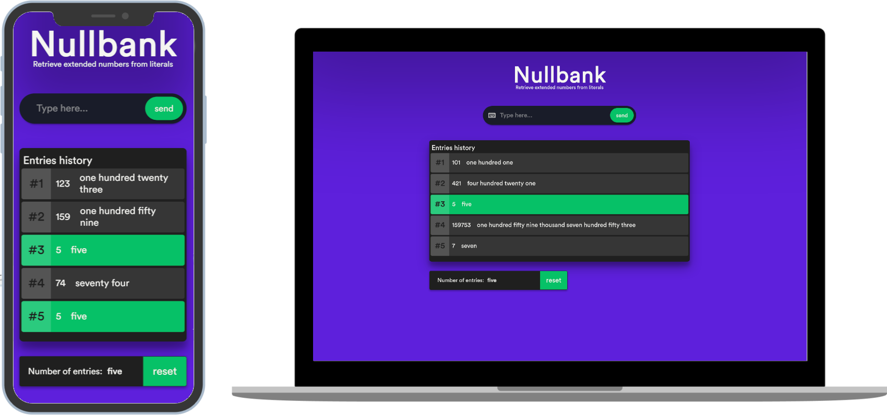

<h1 align="center">NullBank</h1>
<h4 align="center">
  Aplicação de Tradução de números em sua representação textual
</h4>
<p align="center">
  

  
  
  <a href="https://github.com/KZTN/salesfy-challenge-frontend/commits/master">
    
  </a>

  <a href="https://github.com/KZTN/salesfy-challenge-frontend/issues">
    
  </a>
  
</p>
<p align="center">
  
</p>

## ℹ️  Informações

Este é um desafio que faz parte do recrutamento da Salesfy. O projeto já está finalizado e funcional.


## 💻 Projeto

O projeto transforma números de forma numérica para sua respectiva representação textual em inglês através de uma API REST, onde se utiliza requisições e respostas HTTP.

## 🧾  Regras de negócio

- Um número de entrada sempre deverá estar em seu formato numérico
- A tradução literal dos números é dada em inglês
- A margem de números traduzidos estão num alcance de 0 a 999999999999(um trilhão menos um)
- Números negativos, decimais ou fora do limite de números serão descartados
- Caso o número de entradas seja igual ao número pré-registrado no histórico, este receberá uma estilização especial. Vindo a perdê-la ao incremento de novas entradas.


## 🔌 Base url 

Todas chamadas devem usar a url abaixo:
```
http://localhost:3333
```
> Para mais informações do servidor, acesse [o repositório backend](https://github.com/KZTN/SalesfyChallengeBackend)

## Começando...
Essas instruções fornecerão uma cópia do projeto em execução na sua máquina local para fins de desenvolvimento e teste.

### Pré-requisitos
O que você precisa para instalar o software:

```
node v12.x
yarn 1.22.4
git
```

### Instalando o projeto 🚀
Clonando o projeto:

```
git clone https://github.com/KZTN/salesfy-challenge-frontend.git
```

Navegando até a pasta do projeto:

```
cd salesfy-challenge-frontend
```


Baixando as dependências do projeto:

```bash
yarn install
```

Rodando o projeto:

```bash
yarn start
```

Visite http://localhost:3000 para ver o resultado. 🎉

## :memo: Licença

Esse projeto está sob a licença MIT. Veja o arquivo [LICENSE](LICENSE.md) para mais detalhes.
